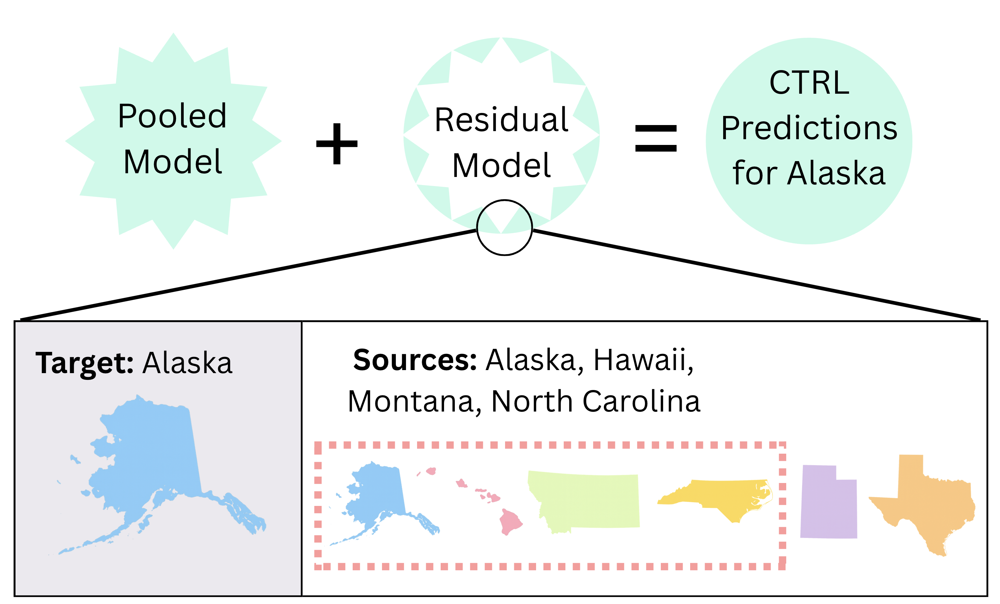

# CTRLYourShift



This repository contains code and datasets for the paper: **XL Models for XS datasets: Using X-Learners for Predicting Education Outcomes in the presence of Extra Small Datasets**

## Contents

- **Main Pipeline Scripts**: `runscript.sh` orchestrates the complete pipeline
- **Baseline Scripts**: `baselines.R` provides results for JTT and RWG baselines
- **Functions/**: Reusable R functions for estimation, prediction, and data handling
- **Data/**: 4 datasets with different characteristics and domains
- **Julia Scripts**: `generate_weights.jl`, `get_assignment.jl`, `get_reward.jl` for optimization and assignment computation

## Datasets

The repository includes 4 datasets, each requiring specific configuration parameters. We provide adapted versions of the datasets to specifically study source level heterogeneity, but the full original dataset links are also provided:

| Dataset | Dataset Name | Group Variable | Outcome Variable | Data Source |
|---------|-------------|----------------|------------------|-------------|
| **Synthetic** | `synthetic` | `group` | `outcome` | Generated data from `generate_synthetic_data.py`|
| **Education** | `education` | `STATE` | `Education` | [Educational Outcomes Dataset](https://github.com/socialfoundations/folktables) |
| **Health** | `health` | `group` | `has_chronic_condition` |[Dissecting Bias Health Dataset](https://gitlab.com/labsysmed/dissecting-bias) |
| **UK Refugee Asylum** | `uk_refugee_asylum` | `nationality` | `outcome_binary` | [UK Refugee Asylum Dataset](https://www.gov.uk/government/statistical-data-sets/asylum-and-resettlement-datasets#asylum-applications-decisions-and-resettlement) |

## Setup

1. **Install required R packages**:
    ```R
    install.packages(c("dplyr", "data.table", "xgboost", "glmnet", "readr", "tidyr", "tidyverse", "parallel"))
    ```

2. **Install Julia dependencies** (optional, for advanced optimization):
    ```julia
    using Pkg
    Pkg.add(["JuMP", "Gurobi", "DataFrames", "CSV"])
    ```

3. **Clone the repository**:
    ```bash
    git clone https://github.com/Gjain234/CTRLYourShift.git
    cd CTRLYourShift
    ```

## Running the Pipeline

### Main Pipeline (`runscript.sh`)

First, make the script executable and then run it:

```bash
chmod +x runscript.sh
./runscript.sh
```

The main pipeline requires you to configure the following parameters in `runscript.sh`:

```bash
# Configuration section in runscript.sh
export data_type="synthetic"        # Dataset name (see table above)
export grouping_var="group"          # Group variable name
export outcome_var="outcome"         # Outcome variable name
export num_iter=250                  # Number of iterations
export max_top_k=10                 # Maximum top-k for ranking
```

**Example configurations for each dataset:**

**Synthetic Dataset:**
```bash
export data_type="synthetic"
export grouping_var="group"
export outcome_var="outcome"
```

**Education Dataset:**
```bash
export data_type="education"
export grouping_var="STATE"
export outcome_var="Education"
```

**Health Dataset:**
```bash
export data_type="health"
export grouping_var="group"
export outcome_var="has_chronic_condition"
```

**UK Refugee Asylum Dataset:**
```bash
export data_type="uk_refugee_asylum"
export grouping_var="nationality"
export outcome_var="outcome_binary"
```

### Pipeline Stages

The `runscript.sh` executes the following stages:

1. **Generate Weights** (R): Creates prediction weights for each iteration
2. **Julia Weight Optimization**: Advanced optimization-based weight generation
3. **Generate Ranks**: Computes rankings based on generated weights
4. **Model Comparison**: Evaluates performance across different approaches
5. **Assignment Computation**: Parallel assignment computation for different methods
6. **Reward Computation**: Final reward computation and plotting

**Note**: The reward generation in Stage 6 computes a debiased reward estimate, which is not included in the paper itself but represents a commonly accepted notion of finding rewards in the absence of counterfactuals. For the RWA estimate in the paper, see `get_RWA.R`.

### Baseline Analysis (`baselines.R`)

Run the baseline script to get results for JTT and RWG baselines:

```bash
Rscript baselines.R
```

**Note**: You may need to modify the dataset configuration in `baselines.R`:
```R
data_type = "synthetic"  # Change to your dataset
grouping_var = 'group'   # Change to your group variable
outcome_var = 'outcome'  # Change to your outcome variable
```

## Output

- **Plots**: Reward and MSE plots are saved in the `plots/` folder
- **Results**: CSV files with detailed results are saved in the `results/` folder
- **Logs**: Execution logs are saved in the `logs/` folder

## Additional Scripts

- **`baselines.R`**: Computes JTT and RWG baseline results
- **`get_RWA.R`**: After running the pipeline, you can run this script to compute the RWA reward for each method.

### Synthetic Data Generation

You can generate custom synthetic datasets using `generate_synthetic_data.py`. While we provide a pre-generated synthetic dataset in `data/synthetic_dataset.csv`, you can create your own datasets with different parameters:

```bash
python generate_synthetic_data.py
```

The script allows you to customize:
- `total_size`: Total number of samples
- `min_group_size`: Minimum group size
- `n_groups`: Number of groups
- `feature_dim`: Number of features
- `global_weight_scale`: Balance between global and local effects

## Notes

- The pipeline can be run in parallel depending on your machine's capabilities
- All scripts are designed to work with the standardized dataset format: `data/{dataset_name}_dataset.csv`
